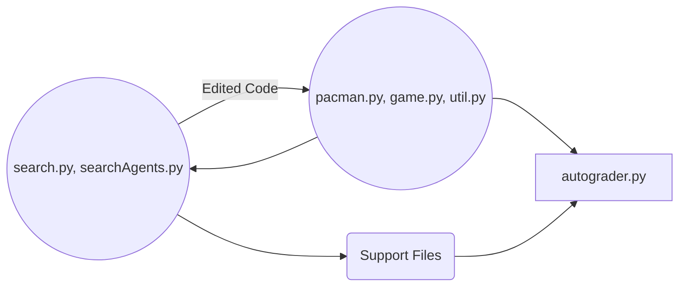

# Welcome to Pacman!

**Project 1** Search,  COMP 569 Artificial Intelligence, Department of Computer Science, California State University Channel Islands.

### Introduction
In this project, your Pacman agent will find paths through his maze world, both to reach a particular location and to collect food efficiently. You will build general search algorithms and apply them to Pacman scenarios. As in Project 0, this project includes an autograder for you to grade your answers on your machine. This can be run with the command: `python autograder.py`

## Files
#### ..you'll edit
|| |
|--|--|
| search.py | Implement depth-first, breadth-first, uniform cost, and A* search algorithms. These algorithms are used to solve navigation and traveling salesman problems in the Pacman world.
searchAgents.py | This file contains all of the agents that can be selected to control Pacman.  To select an agent, use the `-p` option when running `pacman.py`.  Arguments can be passed to your agent using `-a`.  For example, to load a SearchAgent that uses depth first search (DFS), run the following command: `python pacman.py -p SearchAgent -a fn=depthFirstSearch`.

#### ..that can help
|| |
|--|--|
| pacman.py | Holds the logic for the classic pacman game along with the main code to run a game. To play your first game, type `python pacman.py` from the command line. The keys are **a**, **s**, **d**, and **w** to move (Arrow keys).
| game.py | The logic behind how the Pacman world works. This file describes several supporting types like **AgentState**, **Agent**, **Direction**, and **Grid**.
| util.py | Useful data structures for implementing search algorithms.

####  ..to be ignored
|| |
|--|--|
| graphicsDisplay.py, graphicsUtils.py and textDisplay.py | Graphics.
| ghostAgents.py | Agents to control ghosts.
| keyboardAgents.py | Keyboard interfaces to control Pacman. 
| layout.py | Code for reading layout files and storing their contents. 
|autograder.py | Project's autograder.
|testParser.py | Parses autograder test and solution files.
| testClasses.py | General autograding test classes.
| *test_cases/* | Directory containing the test cases for each question.
##

## Cheat sheet
Classes and methods that need your attention.
 - search.py
	 - depthFirstSearch
	 - breadthFirstSearch
	 - uniformCostSearch
	 - aStarSearch
 - searchAgents.py
	 - getStartState
	 - isGoalState
	 - getSuccessors
	 - cornersHeuristic
	 - foodHeuristic
	 - findPathToClosestDot
	 - isGoalState

 (I would recommend making use of resources from util.py for this. :smiley:)
  - util.py
	 - Stack
	 - Queue
	 - PriorityQueue
	 - PriorityQueueWithFunction
	 - manhattanDistance

## Grading
All the code and supporting files are provided in the `search.zip` file in Canvas. 
### Files to Edit and Submit
In order to submit your project, run autograder.py as follow to generate **results.txt** file; then submit search.py, searchAgents.py and **result.txt** to Canvas.

    python autograder.py | tee results.txt

### Evaluation
Your code will be autograded for technical correctness. Please do not change the names of any provided functions or classes within the code, or you will wreak havoc on the autograder.
###### For more information, please read the [Course Materials](Project-1.pdf).
